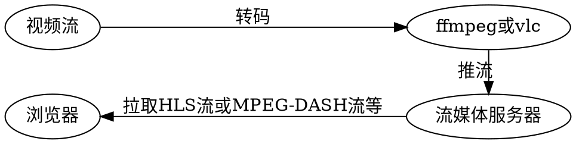

# h264 Streaming

* [x] 浏览器播放H264视频文件
  * 实现JavaScript解码H264视频文件（[详情](https://github.com/panda-zcj/Broadway.git)）
  * 实现node.js搭建的服务器
* [ ] 浏览器播放H264流视频

---

[TOC]

---

## 背景知识

## 前言

>**流媒体**（streaming media）是指将一连串的媒体数据压缩后，经过网络分段发送数据，在网络上即时传输影音以供观赏的一种技术与过程，此技术使得数据包得以像流水一样发送

* 讨论流媒体之前，我们先考虑这样一个问题，即我们如何观看一个远程计算机缓存的视频资源？（[详情参考这里](https://zhuanlan.zhihu.com/p/26121540))

    1. 最简单的方式就是我们将整个视频文件全部下载到本地磁盘，也就是所谓的`下载传输`。**这有个问题，在整个文件下载完成之前，我们不能观看视频。** 所以我们就会理所当然地思考如何可以一边观看、一边下载。

        

    2. **因为不能直接观看的问题，提出了基于 HTTP 的渐进式下载 (Progressive Download) 流媒体播放(也被称为流式传输的`顺序流式传输`，即我们熟知的`点播技术`)**

       但它也存在以下问题

       * 在开始播放之前，我们必须等待⼀段较短的时间⽤于下载和缓冲该媒体⽂件最前⾯的⼀部分数据，以便之后⼀边下载⼀边播放。

       * 需将⽤于初始化解码器的编码参数必须放置在媒体⽂件的起始部位，⾳视频数据完全按照时间顺序进⾏交织等。

       * 渐进下载流媒体播放采⽤标准 HTTP 协议来在 Web 服务器和客户端之间递送媒体数据，⽽HTTP 又承载于 TCP 之上。因此，我们只能在已经下载的那一部分自由拖拽播放，而未下载的部分是不能播放的。

        

    3. 考虑到上述问题，在渐进式下载的基础上，提出了`pseudo-streaming(伪流)技术`。`该技术增强了seek播放功能，也就是支持直接切到未下载的地方进行观看，所以也可以称之为渐进式播放`。其实，到pseudo-streaming 这一步，流媒体播放的技术已经很成熟了，而且目前绝大多数的视频网站都是这种技术，比如Youtube、优酷、腾讯视频等。

        

    4. 当然我们还可以进一步优化，比如同一视频内容会有不同的码率版本，客户端播放器会动态地根据网络质量切换请求带宽匹配的的视频片段。即`自适应码率流媒体技术`。

        

        * 业内比较常见的实现是Apple的`HTTP Live Streaming` (HLS)以及Adobe的`HTTP Dynamic Streaming` (HDS)，下图简单展示了HLS的文件结构，可以看到master playlist包含了两种不同码率的播放列表，当然如果你只有一种版本，那么就不需要master playlist了。`基于HTTP的自适应码率流媒体是有国际标准的，那就是3GPP组织和MPEG小组所提出的MPEG-DASH(Dynamic Adaptive Streaming over HTTP)`。

        

* **流媒体协议是⽀撑流媒体业务运⾏的关键核⼼技术之⼀**

  1. 在传统桌⾯互联⽹时代，常⽤的流媒体协议主要有 HTTP 渐进式下载和基于 RTSP/RTP的实时流媒体协议栈等等，这些流媒体协议⼤多数可以平移到移动流媒体中继续应⽤。然⽽由于移动互联⽹及其终端设备的⼀些独有特性，传统流媒体协议在移动互联⽹中的应⽤在功能、性能的提供和⽤户体验等⽅⾯都会受到不同程度的约束和限制，于是⼀些新的流媒体协议应运⽽⽣。例如，苹果公司的 HTTP Live Streaming 就是其中具有代表性且得到较为⼴泛应⽤的⼀个。



互联网多媒体内容传输从大方向上可以分为下载传输和流式传输。流式传输，换句话来说就是点播(Video on Demand)和直播(Live Streaming)。顾名思义，前者的媒体内容是提前存储在服务器上供客户端请求播放，而后者是实时产生并分发给客户端播放。一般说来，如视频为实时广播，或使用流式传输媒体服务器，或应用如RTSP的实时协议，即为实时流式传输。如使用HTTP服务器，文件即通过顺序流发送。

* http协议的初衷就是作为一个静态的资源让用户访问，但这个延迟不可控；
* 现在主流的推流上行使用的是RTMP协议，其延迟可控；
* 播放侧拉流使用HTTP协议和RTMP协议都一样，对拉流侧来讲两者实时性是一样的。

1.这两者很大的一个区别是就是实时性，RTMP延迟为秒级，HLS（HTTP）的延迟为10秒级。

这样对于对实时性要求较高的直播来说，采用RTMP肯定是不错的选择。

2.那为啥点播不用RTMP呢？点播当然也可以用RTMP，但是要注意的是RTMP是长连接而HLS（HTTP）是短连接，前者在观看视频时必须一直维持一个连接。而后者传输完一段视频片段之后就断开连接，在性能上应该是优于前者的。相对于对实时性要求不高的点播来说，我们当然选性能更好的HLS（HTTP）。因为直播必须RTMP，HTTP不能实现直播。（hls在pc上是不可用的）RTMP虽然可以点播，但是HTTP也能，而且点播和HTTP配合得很好，不需要额外的配套设施（CDN之类）。而如果使用RTMP的点播，还需要为它构建一系列的配套服务，真是得不偿失的，所以没有使用RTMP做点播。

## 直播原理


## 直播方案

互联网上传播音视频内容最早从上世纪90年代开始，RTP等专有协议的提出就是定义音视频的包格式以获得更低的网络传递开销。不过现如今的互联网世界，CDN扮演着非常重要的角色，而绝大部分CDN厂商是不支持RTP等协议的。**基于HTTP的流媒体点播技术则占据着主流**，其有几点优势:

* 防火墙友好；
* 客户端控制媒体流的访问，服务端不需要为每一个客户端连接维护媒体session状态；
* 采用标准的HTTP服务器即可，支撑大规模客户端访问不需要额外的服务器技术资源开销，最重要的就是CDN技术的良好支持优化。

1、不管是RTSP/RTP、RTMP、HTTP，亦或是私有协议，都是可以进行流媒体传输的流媒体协议，而且效果都能做到差不多的程度。虽然HTTP流媒体协议（HLS）会有很大延时，但HLS只是HTTP中的一种，可以用于对延时要求不高的直播，或者微信直播。但HTTP直播协议不止HLS这一种，具体怎么做的，大家可以去搜一搜国外的技术文档，国内做这种的不多；

**每一种协议都有他生存的环境，就像安防不能没有RTSP，因为安防行业很多程序都已经是写的RTSP协议支持，要改就要改平台，要么就换支持RTSP协议的设备，那么你做为摄像机厂商，你到底是支持还是不支持RTSP呢？**

**国内互联网用RTMP，同样的道理，经过了很多年的发展和磨合，很多cdn已经堆这个协议非常完美的支持了，这个稳定的过程都是多少运维人员熬夜熬出来的，cdn不会对稳定盈利的系统轻易做出变化，同样，越来越多的公司来用rtmp，那么就造成cdn更要做rtmp了，这就是一个循环过程，一般的cdn公司不会轻易去打破，除非你是行业巨头，那么问题来了，腾讯就有这个魄力！**

2、RTSP、RTMP、HTTP、私有协议的速度问题

* 然而这些协议在传输、处理效率上都可以做到很优秀
* 低延时、快速出画面、流畅，只是应用场景不一样给你造成的假象，就好比RTMP现在用在网络视频秀直播比较多，就认为RTMP快，RTSP用在安防监控比较多，就认为传的慢，那是错的;
* RTSP用的也是RTP包传输流媒体，RTP也同样用在WebRTC中的即时通信

### WebRTC

<!-- `HTTP渐进下载流媒体播放是基于TCP实现`。`yy、乐视、爱奇艺、优酷土豆、搜狐视频、花椒直播，主要还是通过rtmp和hls来实现直播，但他们也意识到rtmp的天生缺陷，所以不管是技术预研也好，还是测试版也好，都已经或多或少在开发WebRTC了。` -->

### FLV

在介绍flv.js之前先介绍下常见的直播协议以及给出我对它们的延迟与性能所做的测试得出的数据:

* RTMP: 底层基于TCP，在浏览器端依赖Flash。
* HTTP-FLV: 基于HTTP流式IO传输FLV，依赖浏览器支持播放FLV。
* WebSocket-FLV: 基于WebSocket传输FLV，依赖浏览器支持播放FLV。WebSocket建立在HTTP之上，建立WebSocket连接前还要先建立HTTP连接。
* HLS: Http Live Streaming，苹果提出基于HTTP的流媒体传输协议。HTML5可以直接打开播放。
* RTP: 基于UDP，延迟1秒，浏览器不支持。

常见直播协议延迟与性能数据以下数据只做对比参考

|传输协议|播放器|延迟|内存|CPU|
|---|---|---|---|---|
|RTMP|Flash|1s|430M|11%|
|HTTP-FLV|Video|1s|310M|4.4%|
|HLS|Video|20s|205M|3%|

在支持浏览器的协议里，延迟排序是：
RTMP = HTTP-FLV = WebSocket-FLV < HLS
而性能排序恰好相反：
RTMP > HTTP-FLV = WebSocket-FLV > HLS
也就是说延迟小的性能不好。

**可以看出在浏览器里做直播，使用HTTP-FLV协议是不错的，性能优于RTMP+Flash，延迟可以做到和RTMP+Flash一样甚至更好。**

---
flv.js 简介

flv.js是来自Bilibli的开源项目。它解析FLV文件喂给原生HTML5 Video标签播放音视频数据，使浏览器在不借助Flash的情况下播放FLV成为可能。[详情请查看](https://github.com/gwuhaolin/blog/issues/3)

---
flv.js 优势

* 由于浏览器对原生Video标签采用了硬件加速，性能很好，支持高清。
* 同时支持录播和直播
* 去掉对Flash的依赖

---
flv.js 限制

* **FLV里所包含的视频编码必须是H.264，音频编码必须是AAC或MP3， IE11和Edge浏览器不支持MP3音频编码，所以FLV里采用的编码最好是H.264+AAC，这个让音视频服务兼容不是问题**。
* 对于录播，依赖 原生HTML5 Video标签 和 Media Source Extensions API
* 对于直播，依赖录播所需要的播放技术，同时依赖 HTTP FLV 或者 WebSocket 中的一种协议来传输FLV。其中HTTP FLV需通过流式IO去拉取数据，支持流式IO的有fetch或者 stream
* flv.min.js 文件大小 164Kb，gzip后 35.5Kb，flash播放器gzip后差不多也是这么大。
* **由于依赖Media Source Extensions，目前所有iOS和Android4.4.4以下里的浏览器都不支持，也就是说目前对于移动端flv.js基本是不能用的。**

---
flv.js依赖的浏览器特性兼容列表

* [HTML5 Video](http://caniuse.com/#feat=webm)
* [Media Source Extensions](http://caniuse.com/#feat=mediasource)
* [WebSocket](http://caniuse.com/#feat=websockets)
* HTTP FLV: [fetch](http://caniuse.com/#feat=fetch) 或 [stream](http://caniuse.com/#feat=http-live-streaming)

---
flv.js 原理

flv.js只做了一件事，在获取到FLV格式的音视频数据后通过原生的JS去解码FLV数据，再通过Media Source Extensions API 喂给原生HTML5 Video标签。(HTML5 原生仅支持播放 mp4/webm 格式，不支持 FLV)

flv.js 为什么要绕一圈，从服务器获取FLV再解码转换后再喂给Video标签呢？原因如下：

1. 兼容目前的直播方案：目前大多数直播方案的音视频服务都是采用FLV容器格式传输音视频数据。
2. FLV容器格式相比于MP4格式更加简单，解析起来更快更方便。

---
flv.js兼容方案

由于目前flv.js兼容性还不是很好，要用在产品中必要要兼顾到不支持flv.js的浏览器。兼容方案如下：

PC端

1. 优先使用 HTTP-FLV，因为它延迟小，性能也不差1080P都很流畅。
2. 不支持 flv.js 就使用 Flash播放器播 RTMP 流。Flash兼容性很好，但是性能差默认被很多浏览器禁用。
3. 不想用Flash兼容也可以用HLS，但是PC端只有Safari支持HLS

移动端

1. 优先使用 HTTP-FLV，因为它延迟小，支持HTTP-FLV的设备性能运行 flv.js 足够了。
2. 不支持 flv.js 就使用 HLS，但是 HLS延迟非常大。
HLS 也不支持就没法直播了，因为移动端都不支持Flash。

### RTMP

RTMP（Real Time Messaging Protocol）是Adobe Systems公司为Flash播放器和服务器之间音频、视频和数据传输开发的开放协议。它有三种变种：

* 工作在TCP之上的明文协议，使用端口1935；
* RTMPT封装在HTTP请求之中，可穿越防火墙；
* RTMPS类似RTMPT，但使用的是HTTPS连接。

RTMP视频播放的特点：

1. **RTMP协议是采用实时的流式传输**，`所以不会缓存文件到客户端，这种特性说明用户想下载RTMP协议下的视频是比较难的`；

2. 视频流可以随便拖动，既可以从任意时间点向服务器发送请求进行播放，并不需要视频有关键帧。**相比而言，HTTP协议下视频需要有关键帧才可以随意拖动**。

3. **RTMP协议支持点播/回放（通俗点将就是支持把flv,f4v,mp4文件放在RTMP服务器，客户端可以直接播放），直播（边录制视频边播放）。**

RTMP环境的架设：

因为该协议是adobe公司开发的，所以最初服务器端架设的环境是FMS(Flash Media Server)，该软件为收费软件，价格昂贵。后来，开源软件red5的推出，使rtmp协议的架设成本大大缩小，但是在性能方面不如fms的稳定。此外，wowza虽然是收费的，但价格比较适中。

### HLS

HTTP Live Streaming(HLS)是苹果公司实现的基于HTTP的流媒体传输协议，可实现流媒体的`直播和点播`，主要应用于iOS系统。HLS点播是分段HTTP点播，不同在于它的分段非常小。要实现`HLS点播`，重点在于对媒体文件分段，目前有不少开源工具可以使用。

相对于常见的流媒体直播协议，HLS直播最大的不同在于，直播客户端获取到的并不是一个完整的数据流，HLS协议在服务器端将直播数据流存储为连续的、很短时长的媒体文件（MPEG-TS格式），而客户端则不断的下载并播放这些小文件，因为服务器总是会将最新的直播数据生成新的小文件，这样客户端只要不停的按顺序播放从服务器获取到的文件，就实现了直播。`由此可见，基本上可以认为，HLS是以点播的技术方式实现直播`。`由于数据通过HTTP协议传输，所以完全不用考虑防火墙或者代理的问题，而且分段文件的时长很短，客户端可以很快的选择和切换码率，以适应不同带宽条件下的播放`。不过HLS的这种技术特点，决定了它的延迟一般总是会高于普通的流媒体直播协议。

### RTP/RTCP


RTP(Real-time Transport Protocol)是用于Internet上针对多媒体数据流的一种传输协议。RTP由两个紧密链接部分组成:

* RTP----传送具有实时属性的数据；
* RTP控制协议（RTCP）----监控服务质量并传送正在进行的会话参与者的相关信息。

`RTP协议建立在UDP协议上`,RTP协议详细说明了在互联网上传递音频和视频的标准数据包格式。`RTP协议常用于流媒体系统（配合RTCP协议）、视频会议和视频电话系统（配合H.263或SIP）`。

`RTP本身并没有提供按时发送机制或其他服务质量（QoS）保证`，它依赖于底层服务去实现这一过程。RTP并不保证传送或防止无序传送，也不确定底层网络的可靠性。RTP实行有序传送，RTP中的序列号允许接收方重组发送方的包序列，同时序列号也能用于决定适当的包位置。例如：在视频解码中，就不需要顺序解码。

实时传输控制协议（Real-time Transport Control Protocol,RTCP）是实时传输协议（RTP）的一个姐妹协议。RTCP为RTP媒体流提供信道外控制。RTCP定期在流多媒体会话参加者之间传输控制数据。RTCP的主要功能是为RTP所提供的服务质量提供反馈。`RTCP收集相关媒体连接的统计信息，例如：传输字节数，传输分组数，丢失分组数，时延抖动，单向和双向网络延迟等等`。**网络应用程序可以利用RTCP所提供的信息试图提高服务质量，比如限制信息流量或改用压缩比较小的编解码器**。RTCP本身不提供数据加密或身份认证，其伴生协议SRTCP（安全实时传输控制协议）则可用于此类用途。

### RTSP


作为一个**应用层协议**，RTSP提供了一个可供扩展的框架，`它的意义在于使得实时流媒体数据的`受控和点播`变得可能`。`总的说来，RTSP是一个流媒体表示协议，主要用来`控制`具有实时特性的数据发送，但它本身并不传输数据，而是必须依赖于下层传输协议所提供的某些服务`。**RTSP可以对流媒体提供诸如播放、暂停、快进等操作，它负责定义具体的控制消息、操作方法、状态码等，此外还描述了与RTP间的交互操作（RFC2326）**。

RTSP在制定时较多地参考了HTTP/1.1协议，甚至许多描述与HTTP/1.1完全相同。RTSP之所以特意使用与HTTP/1.1类似的语法和操作，在很大程度上是为了兼容现有的Web基础结构，正因如此，HTTP/1.1的扩展机制大都可以直接引入到RTSP中。
**由RTSP控制的媒体流集合可以用表示描述（Presentation  Description）来定义，所谓表示是指流媒体服务器提供给客户机的一个或者多个媒体流的集合，而表示描述则包含了一个表示中各个媒体流的相关信息，如数据编码/解码算法、网络地址、媒体流的内容等**。
虽然RTSP服务器同样也使用标识符来区别每一流连接会话（Session），但RTSP连接并没有被绑定到传输层连接（如TCP等），也就是说在整个RTSP连接期间，RTSP用户可打开或者关闭多个对RTSP服务器的可靠传输连接以发出RTSP请求。此外，RTSP连接也可以基于面向无连接的传输协议（如UDP等）。
RTSP协议目前支持以下操作：

* 检索媒体：允许用户通过HTTP或者其它方法向媒体服务器提交一个表示描述。如表示是组播的，则表示描述就包含用于该媒体流的组播地址和端口号；如果表示是单播的，为了安全在表示描述中应该只提供目的地址。
* 邀请加入：媒体服务器可以被邀请参加正在进行的会议，或者在表示中回放媒体，或者在表示中录制全部媒体或其子集，非常适合于分布式教学。
* 添加媒体：通知用户新加入的可利用媒体流，这对现场讲座来讲显得尤其有用。

RTSP 是一种文本协议，采用 UTF-8 编码中的 ISO 10646 字符集。一行可通过 CRLF终止，但接收端需要做好解释 CR 和 LF 作为一行终止符的准备。关于头字段概述如下：

|Header|Type|Support|Methods|
|---|---|---|---|
|Accept|R|opt.|entity|
|Accept-Encoding|R|opt.|entity|
|Accept-Language|R|opt.|all|
|Allow|R|opt.|all|
|Authorization|R|opt.|all|
|Bandwidth|R|opt.|all|
|Blocksize|R|opt.|All but OPTIONS, TEARDOWN|
|Cache-Control|G|opt.|SETUP|
|Conference|R|opt.|SETUP|
|Connection|G|req.|all|
|Content-Base|E|opt.|entity|
|Content-Encoding|E|req.|SET_PARAMETER|
|Content-Encoding|E|req.|DESCRIBE, ANNOUNCE|
|Content-Language|E|req.|DESCRIBE, ANNOUNCE|
|Content-Length|E|req.|SET_PARAMETER, ANNOUNC|E
|Content-Length|E|req.|entity|
|Content-Location|E|opt.|entity|
|Content-Type|E|req.|SET_PARAMETER, ANNOUNCE|
|Content-Type|R|req.|entity|
|CSeq|G|req.|all|
|Date|G|opt.|all|
|Expires|E|opt.|DESCRIBE, ANNOUNCE|
|From|R|opt.|all|
|If-Modified-Since|R|opt.|DESCRIBE, SETUP|
|Last-Modified|E|opt.|entity|
|Proxy-Authenticate| | |
|Proxy-Require|R|req.|all|
|Public|R|opt.|all|
|Range|R|opt.|PLAY, PAUSE, RECORD|
|Range|R|opt.|PLAY, PAUSE, RECORD|
|Referer|R|opt.|all|
|Require|R|req.|all|
|Retry-After|R|opt.|all|
|RTP-Info|R|req.|PLAY|
|Scale|Rr|opt.|PLAY, RECORD|
|Session|Rr|req.|All but SETUP, OPTIONS|
|Server|R|opt.|all|
|Speed|Rr|opt.|PLAY|
|Transport|Rr|req.|SETUP|
|Unsupported|R|req.|all|
|User-Agent|R|opt.|all|
|Via|G|opt.|all|
|WWW-Authenticate|R|opt.|all|
类型 "g" 表示请求和响应中的通用请求头；
类型 "R" 表示请求头；类型 "r" 表示响应头；
类型 "e" 表示实体头字段。
在"support" 一栏中 标有 "req." 的字段 必须由接收者以特殊的方法实现；
而"opt." 的字段是可选的;
注意，不是所有"req." 字段在该类型的每个请求中都会被发送。
"req."只表示客户机（支持响应头）和服务器（支持请求头）必须执行该字段。最后一栏列出了关于头字段产生作用的方法；
其中 "entity"针对于返回一个信息主体的所有方法。

---

RTSP消息格式:

RTSP的消息有两大类--- 请求消息(request), 回应消息(response) 。

请求消息 ：
方法 URI RTSP版本 CRLF
消息头 CR LF CRLF
消息体 CRLF

其中方法包括OPTION回应中所有的命令,URI是接受方的地址,例如:rtsp://192.168.20.136。RTSP版本一般都是RTSP/1.0。每行后面的CR LF表示回车换行，需要接受端有相应的解析，最后一个消息头需要有两个CR LF

回应消息 ：
RTSP版本 状态码 解释 CRLF
消息头 CR LF CRLF
消息体 CRLF

其中RTSP版本一般都是RTSP/1.0, 状态码是一个数值, 200表示成功, 解释是与状态码对应的文本解释.

---

### SDP文件

* SDP用于描述多媒体通信会话，包括会话建立、会话请求和参数协商。
* SDP不用于传输媒体数据，只能用于两个通信终端的参数协商，包括媒体类型、格式以及所有其他和会话相关的属性。
* SDP以字符串的形式描述上述初始化参数。SDP目的就是在媒体会话中，传递媒体流信息，允许会话描述的接收者去参与会话。
SDP基本上在Internet上工作,他定义了会话描述的统一格式,但并不定义多播地址的分配和SDP消息的传输,也不支持媒体编码方案的协商,这些功能均由下层传送协议完成。典型的会话传送协议包括:SAP(Session Announcement Protocol会话公告协议),SIP(Session Initiation Protocol，会话初始协议),RTSP,HTTP,和使用MIME的E-Mail。

SDP文件包括以下一些方面：

1. 会话的名称和目的
2. 会话存活时间
3. 包含在会话中的媒体信息，包括：
    * 媒体类型(video,audio, etc)
    * 传输协议(RTP/UDP/IP,H.320, etc)
    * 媒体格式(H.261video, MPEG video, etc)
    * 多播或远端（单播）地址和端口
4. 为接收媒体而需的信息(addresses, ports, formats and so on)
5. 使用的带宽信息
6. 可信赖的接洽信息(Contact information)

sdp 的格式：
v=\<version>
o=\<username>\<session id>\<version>\<networktype>\<address type>\<address>
s=\<session name>
i=\<session description>
u=\<URI>
e=\<email address>
p=\<phone number>
c=\<network type>\<address type>\<connection address>
b=\<modifier>:\<bandwidth-value>
t=\<start time>\<stop time>
r=\<repeat interval>\<active duration>\<list of offsets fromstart-time>
z=\<adjustment time>\<offset> \<adjustmenttime> \<offset>
k=\<method>
k=\<method>:\<encryptionkey>
a=\<attribute>
a=\<attribute>:\<value>
m=\<media>\<port>\<transport> \<fmtlist>
v=（协议版本）
o=（所有者/创建者和会话标识符）
s=（会话名称）
i =* （会话信息）
u=* （URI 描述）
e=* （Email 地址）
p=* （电话号码）
c=* （连接信息）
b=* （带宽信息）
z=* （时间区域调整）
k=* （加密密钥）
a=* （ 0 个或多个会话属性行）

时间描述：
t= （会话活动时间）
r=* （0或多次重复次数）

媒体描述：
m=（媒体名称和传输地址）
i =* （媒体标题）
c=* （连接信息 — 如果包含在会话层则该字段可选）
b=* （带宽信息）
k=* （加密密钥）
a=* （0 个或多个媒体属性行）

1. SDP会话描述由多行\<type>=\<value>组成。其中\<type>是一个字符。\<value>是一个字符串，其格式视\<type>而定。整个协议区分大小写。“=”两侧不允许有空格;
2. SDP会话描述由一个会话级描述（session_level description）和多个媒体级描述（media_level description）组成;
3. 会话级（session_level）描述的作用域是整个会话。其位置是从’v=’行开始到第一个媒体描述为止;
4. 媒体级（media_level）描述是对单个的媒体流进行描述（`例如传送单个音频或者视频的vlc sdp文件只有短短的几句话，从m=开始，这其实就是个媒体机描述`），其位置是从’m=’行开始到下一个媒体描述为止;
5. 总之，除非媒体部分重载，会话级的值是各个媒体的缺省默认值（`就是说媒体级描述其实也是一个会话级描述，只不过没写出来的会话级描述参数都用的缺省值`）。

* 上面的有些行是必需有的，有些行是可选的;
* 可选的行有*号标记;
* 必需的是v,o,s,t,m（这是对于会话级描述和媒体及描述总体而言的，对于媒体级描述而言只有m=是必须的;
* **注意所有的描述项必须按照上面的顺序给出**。

下面介绍一些常用的参数

1. packetization-mode（表示支持的封包模式）：
    * 当 packetization-mode 的值为 0 时或不存在时, 必须使用单一 NALU 单元模式（不分片）。
    * 当 packetization-mode 的值为 1 时必须使用非交错(non-interleaved)封包模式（即要求每个RTP中只有一个NAL单元，或者一个FU）。
    * 当 packetization-mode 的值为 2 时必须使用交错(interleaved)封包模式。
2. sprop-parameter-sets（SPS,PPS）:
    * 这个参数可以用于传输H.264的**序列参数集和图像参数NAL单元**。**这个参数的值采用Base64进行编码，不同的参数集间用","号隔开。**
    * SPS即Sequence Paramater Set，又称作序列参数集。SPS中保存了一组编码视频序列(Coded video sequence)的全局参数。所谓的编码视频序列即原始视频的一帧一帧的像素数据经过编码之后的结构组成的序列。而每一帧的编码后数据所依赖的参数保存于图像参数集中。一般情况SPS和PPS的NAL Unit通常位于整个码流的起始位置。
    * 除了**序列参数集SPS**之外，H.264中另一重要的参数集合为**图像参数集Picture Paramater Set(PPS)**。通常情况下，PPS类似于SPS，在H.264的裸码流中单独保存在一个NAL Unit中，只是PPS NAL Unit的nal_unit_type值为8；而在封装格式中，PPS通常与SPS一起，保存在视频文件的文件头中。
    * 在H264码流中,都是以"0x00 0x00 0x01"或者"0x00 0x00 0x00 0x01"为开始码的,找到开始码之后,使用开始码之后的第一个字节的低5位判断是否为**7(sps)或者8(pps)**, 及data[4] & 0x1f == 7 || data[4] & 0x1f ==8。然后对获取的nal去掉开始码之后进行base64编码,得到sprop-parameter-sets参数。
3. profile-level-id:
    * 这个参数用于指示H.264流的profile类型和级别，为Base16(十六进制)表示的3个字节。第一个字节表示H.264的Profile 类型, 第三个字节表示H.264的Profile级别。
    * **值为sps的第二个字节开始的三个字节**

## video.js

为什么要使用video.js？

1. PC端浏览器并不支持video直接播放m3u8格式的视频
2. 手机端各式各样的浏览器定制的video界面风格不统一，直接写原生的js控制视频兼容性较差
3. video.js解决以上两个问题，还可以有各种视频状态接口暴露，优化体验

Video.js是什么

1. web视频播放器，使用html5和flash两种播放方式
2. 几乎兼容所有的浏览器，并且优先使用html5，在不支持的浏览器中，会自动使用flash进行播放
3. 界面可以定制，纯javascript和css打造
4. [官方网站](http://videojs.com/)

---
运用方式

1. 页面link引入video-js.css
2. 引入script引入video.js
3. 页面元素两个标签,如下所示

```html
<video class="video-js vjs-default-skin" controls width="640" height="264">
<source src="xxxx.mp4" type="video/mp4" />  
</video>
```

js中用全局函数videojs进行初始化

```javascript
var options = {  }
//参数1，video标签的id
//参数2，配置选项options，组件设置写在这里
//要用到第三参数onready的话，options不能省略，必须要用{ }占位
//参数3，onready是videojs初始化完成之后的回调函数，事件写在这里
videojs('#id', options, function VideoOnReady(){
    //可以用this引用videojs的实例对象
    //进行this.play(),this.pause()等操作
    //还可以用this.on('ended')监听事件
  });
```

---
**初始化option配置：组件与元素**
option配置的两种传入方式

* 写入video标签的data-setup属性。写在html标签中，通过JSON.parse解析，性能低，还容易报错

    ```html
    <video data-setup='{"autoplay":"true",.....}'
    ```

* 在js中将option传入初始化的player对象（已被本文选用的默认方式）

`常见options成员（写在option这个对象中`

* autoplay :  true/false
播放器准备好之后，是否自动播放，默认false
* controls : true/false
是否拥有控制条 ，默认true
如果设为false ,界面上不会出现任何控制按钮，那么只能通过api进行控制了
* height: 字符串或数字（字符串带单位）
视频容器的高度，比如： height:300 or height:'300px'
* width: 字符串或数字
视频容器的宽度, 单位像素
* loop : true/false
视频播放结束后，是否循环播放
* muted : true/false
是否静音
* poster: 通常传入一个URL
播放前显示的视频画面，播放开始之后自动移除。
* preload(预加载): 'auto'/ 'metadata' / 'none'
  * auto-自动
  * metadata-元数据信息 ，比如视频长度，尺寸等
  * none-不预加载任何数据，直到用户开始播放才开始下载

* children(可选子组件): Array | Object
  * 从基础的Component组件继承而来的子组件
  * 数组中的顺序将影响组件的创建顺序
  * 整后会生成的dom少一些，加载也快一些


* sources(资源文件):Array

```javascript
sources: [{ src: '...mp4', type: 'video/mp4'}, { src: '...webm', type: 'video/webm'}]
```

等价于html中的

```html
<source src="...mp4" type="video/mp4">
```

* techOrder: ['html5']
默认为['html5']，'flash'可以有，比如 ['html5', 'flash']
在v6.0.0 及以上的版本中，默认不包含flash的使用代码。如果要使用flash播放的，需要手动引入flash相关逻辑的代码。且需要指定swf文件的路径。


* plugins:自动初始化要加载的插件（未研究）
option配置参数详细列表:[官方文档](https://link.jianshu.com/?t=http%3A%2F%2Fdocs.videojs.com%2Ftutorial-options.html)

* api与事件
  * 常用操作api
    pause //暂停
    play //播放
    dispose //清理-销毁
    on //监听事件
    trigger //触发事件

  * 常用事件
    play //播放
    pause //暂停
    ended //结束
    error 错误
    loadeddata //数据加载完成

## 音视频

* 常情况下一个视频会包含video和audio两条track，还有一条hint track是为streaming准备的。
* 立体声（英语：stereo）是使用两个或多个独立的音效通道，在一对以对称方式配置的扬声器（即俗称的喇叭）上出现。以此方法所发出的声音，在不同方向仍可保持自然与悦耳。与之相对的是单声道。
* 混音 是把多种来源的声音，整合至一个立体音轨（Stereo）或单音音轨（Mono）中。
